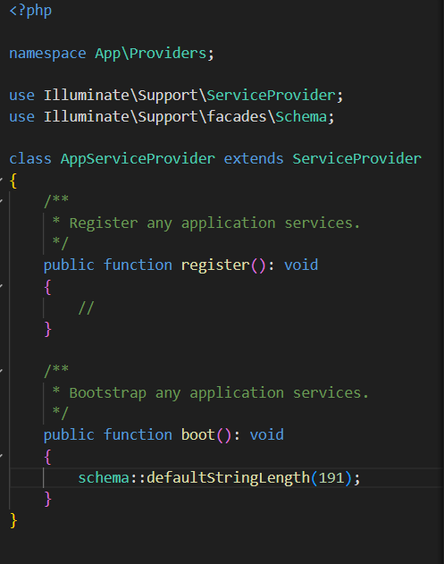

# README - Laboratorio: Implementación de Login en Laravel

> **Proyecto:** Laboratorio 1 — Primer acercamiento a Laravel (MVC)

---

## Índice

1. Descripción
2. Requisitos previos
3. Instalación y flujo de comandos utilizados
4. Estructura del proyecto y breve explicación MVC
5. Base de datos (.env, migraciones, respaldo)
6. Resultado (capturas de pantalla)
7. Dificultades encontradas y soluciones aplicadas
8. Referencias / Fuentes consultadas
9. Fecha de ejecución
10. Footer (datos del desarrollador)

---

## 1. Descripción

Este repositorio documenta el proceso de configuración e implementación del módulo de **Login** en Laravel como parte del laboratorio de la unidad `Modelo–Vista–Controlador (MVC)`. Aquí se describen los pasos seguidos, los comandos ejecutados, la configuración de la base de datos, los problemas encontrados y las soluciones aplicadas. El objetivo es entregar un README claro que sirva de referencia para futuras prácticas.

---

## 2. Requisitos previos

**Hardware / OS**

* Sistema operativo: Windows 10 (entorno de desarrollo con WampServer)

**Software / Herramientas**

* PHP 8.3
* Composer (última versión estable)
* Laravel (última versión estable al momento de la práctica)
* Servidor local: WampServer
* Servidor web: Apache
* Base de datos: MySQL en ejecución
* Node.js y npm (para compilar assets front-end)
* Editor de código: Visual Studio Code

---

## 3. Instalación y flujo de comandos utilizados

```bash
# 1. Crear proyecto (si aplica)
composer create-project laravel/laravel nombre-proyecto
# o usando el instalador de Laravel
laravel new nombre-proyecto

cd nombre-proyecto

# 2. Instalar dependencias PHP (si clonaste el repo)
composer install

# 3. Copiar .env y generar key
cp .env.example .env       # en Windows: copy .env.example .env
php artisan key:generate

# 4. Editar .env -> configurar DB
# DB_DATABASE=nombre_db
# DB_USERNAME=root
# DB_PASSWORD=

# 5. Ejecutar migraciones
php artisan migrate

# 6. Instalar scaffolding de autenticación (ejemplo con laravel/ui)
composer require laravel/ui
php artisan ui bootstrap --auth
npm install && npm run dev

# 7. Levantar servidor de desarrollo
php artisan serve

# 8. Opcional: limpiar cache de config
php artisan config:clear
php artisan config:cache
```

---

## 4. Estructura del proyecto y explicación breve de MVC

* **app/Models/**: Contiene los Modelos (representación de tablas/entidades). Ej. `User.php`.
* **app/Http/Controllers/**: Controladores que reciben peticiones, ejecutan lógica y retornan vistas o respuestas.
* **routes/web.php**: Define las rutas web que apuntan a controladores o closures y las vistas.
* **resources/views/**: Vistas (`Blade` templates) responsables de la presentación (HTML/CSS/JS).
* **database/migrations/**: Archivos PHP que describen la estructura de las tablas.

**Resumen MVC**

* *Model*: Gestiona datos y reglas de negocio (ORM Eloquent).
* *View*: Plantillas Blade que muestran la interfaz.
* *Controller*: Conecta modelos y vistas, procesa peticiones y valida datos.

---

## 5. Base de datos

### Archivo `.env` (fragmento relevante)

```dotenv
APP_NAME=Laravel
APP_ENV=local
APP_KEY=base64:XXXXXXXXXXXX
APP_DEBUG=true
APP_URL=http://localhost:8000

DB_CONNECTION=mysql
DB_HOST=127.0.0.1
DB_PORT=3306
DB_DATABASE=login_lab
DB_USERNAME=root
DB_PASSWORD=
```

### Migraciones

* Ejecutadas con: `php artisan migrate`
* Si aparece error de longitud de cadena en MySQL (índice), usar en `AppServiceProvider`:

```php
use Illuminate\Support\Facades\Schema;

public function boot()
{
    Schema::defaultStringLength(191);
}
```

### Respaldo (backup) de la base de datos

En este laboratorio **no se generó respaldo SQL**, pero se recomienda en prácticas futuras incluirlo en `database/backups/`.

---

## 6. Resultado (capturas de pantalla)

A continuación se incluyen las capturas extraídas del informe en Word, mostrando el laboratorio funcionando (pantallas de login, registro y vistas principales):





---

## 7. Dificultades y soluciones (experiencia real)

Durante la ejecución del laboratorio se presentaron las siguientes complicaciones y se registraron las soluciones aplicadas por el estudiante:

* **Dificultad 1: No se pudo instalar Laravel (faltaba la extensión ZIP y Git).**

  * *Detalle:* PHP reportaba que la extensión ZIP estaba deshabilitada y además se requería Git para completar la instalación.
  * *Solución aplicada:* Editar `php.ini` (buscar `;extension=zip`) y descomentar la línea (quitar `;`). Instalar Git en el sistema.

* **Dificultad 2: Error al ejecutar migraciones — la tabla `users` ya existía.**

  * *Detalle:* Al ejecutar `php artisan migrate` Laravel intentaba crear nuevamente tablas ya presentes en la BD, provocando errores.
  * *Solución aplicada:* Ejecutar `php artisan migrate:fresh` para resetear la base de datos y luego `php artisan migrate`. Tras esto `php artisan migrate` mostró "nothing to migrate".

* **Dificultad 3: Problemas al ejecutar `npm install` por políticas de ejecución de scripts en PowerShell.**

  * *Detalle:* Windows bloqueaba la ejecución de scripts locales, impidiendo la instalación de paquetes y el scaffolding.
  * *Solución aplicada:* Abrir PowerShell como administrador y ejecutar `Set-ExecutionPolicy Unrestricted` para permitir la ejecución de scripts locales. Luego volver a ejecutar `npm install` y continuar con `npm run dev`.

* **Dificultad 4: Error de conexión a la base de datos en tiempo de compilación (`Access denied for user 'root'@'localhost'`).**

  * *Detalle:* Al intentar ejecutar `composer run dev` o al compilar assets, Laravel intentaba conectar a MySQL con credenciales incorrectas.
  * *Solución aplicada:* Revisar y sanear el archivo `.env`. En este caso el autor había puesto `DB_PASSWORD=demo`; al eliminar la contraseña o ajustarla para que coincida con la configuración de MySQL, el error se resolvió.

---

## 8. Referencias / Fuentes consultadas

* [Documentación oficial de Laravel](https://laravel.com/docs)
* [Laracasts](https://laracasts.com/discuss)
* [Stack Overflow — Laravel tag](https://stackoverflow.com/questions/tagged/laravel)

---

## 9. Fecha de ejecución del laboratorio

**Fecha de ejecución:** 14 de septiembre de 2025
**Fecha de entrega:** 15 de septiembre de 2025

---

## 10. Footer (datos del desarrollador)

> Este laboratorio ha sido desarrollado por el estudiante de la Universidad Tecnológica de Panamá:

* **Nombre:** Ricardo Gadiel Solis Olave
* **Correo:** [ricarditogadiel99@gmail.com](mailto:ricarditogadiel99@gmail.com)
* **Curso / Sección:** Ingeniería Web
* **Profesor:** Ing. Irina Fong
* **Repositorio del proyecto:** [Login-laravel](https://github.com/rickigad/Login-laravel.git)
